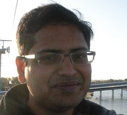
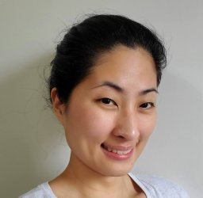
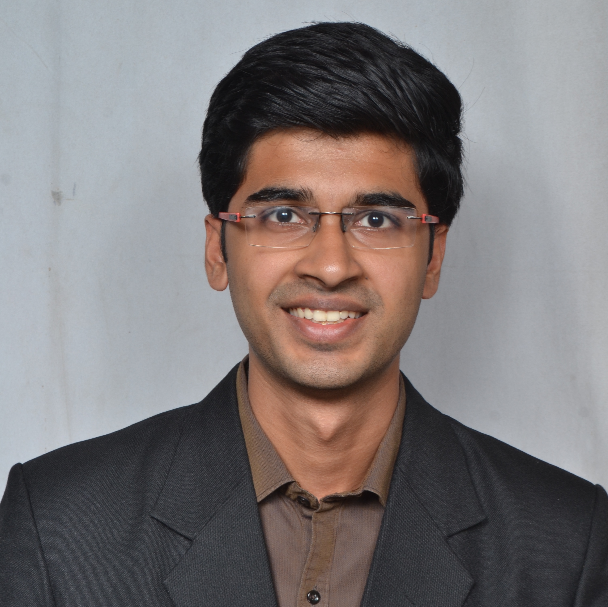
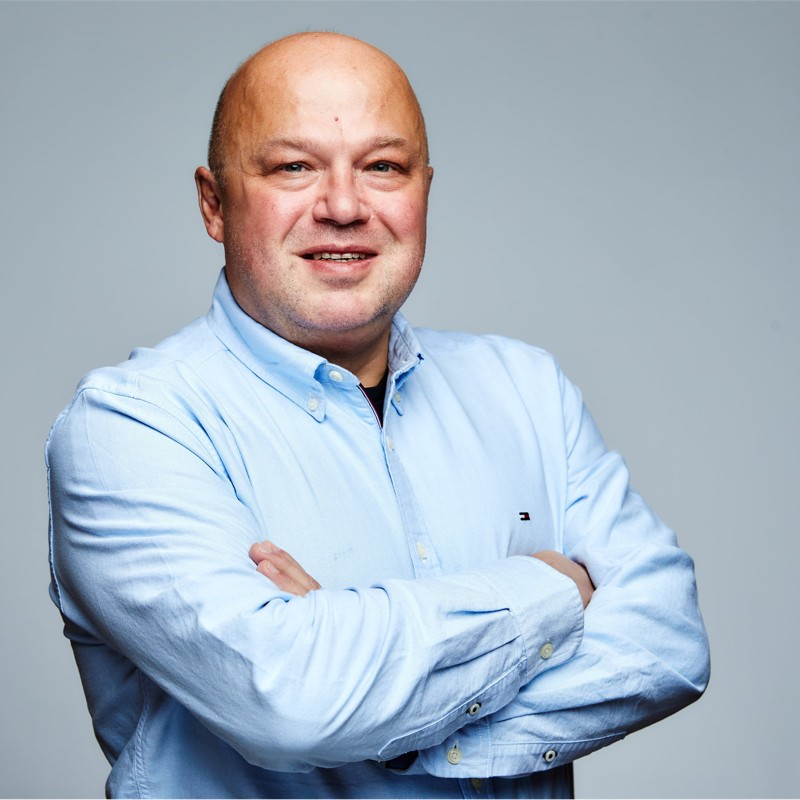

## Overview

The advent of multimodal LLMs like GPT-4o and Gemini has significantly boosted the potential for multimodal search and recommendations. Traditional search engines rely mainly on textual queries, supplemented by session and geographical data. In contrast, multimodal systems create a shared embedding space for text, images, audio, and more, enabling next-gen customer experiences. These advancements lead to more accurate and personalized recommendations, enhancing user satisfaction and engagement.

MMSR will be a **full-day** workshop at [CIKM 2024](https://cikm2024.org/). The workshop will be held on **October 25, 2024** at **Boise Center, Idaho, USA**. The workshop will explore the latest advancements, challenges, and applications of multimodal search and recommendations.

**[Register to attend the workshop](https://cikm2024.org/registrations/)**

## Workshop Program Format

The workshop will include keynote speeches, research paper presentations, interactive networking sessions, and a panel discussion on **_Emerging trends and challenges in multimodal search and recommendations_**. The workshop will primarily be in person. 

_*Detailed schedule will be posted here closer to the workshop date._

- 2 invited talks
- Long (20 min) contributed talks
  - 15 min paper presentations
  - 5 min lightning discussions
- Panel discussion

## Keynote Speakers

  

    
    

      <strong><a href="https://www.linkedin.com/in/vamsisalaka/" style="text-decoration: none;color: black;">Dr. Vamsi Salaka</a></strong> is the Head of Visual Search at Amazon where he oversees initiatives to build cutting edge image and multimodal search systems.
    

  

  

    
    

      <strong><a href="https://www.linkedin.com/in/yubink/" style="text-decoration: none;color: black;">Dr. Yubin Kim</a></strong> is the Head of Engineering at Vody, a multimodal GenAI startup. Dr. Kim is a seasoned search & recommendations leader with experience in pragmatically solving multimodal problems at scale.
    

  

## Organizers

  

    
    <strong><a href="https://www.linkedin.com/in/aditya-chichani/" style="text-decoration: none;color: black;">Aditya Chichani</a></strong>
  

  
  

    
    <strong><a href="https://www.linkedin.com/in/surya-kallumadi-a0778a13/" style="text-decoration: none;color: black;">Surya Kallumadi</a></strong>
  

  

    
    <strong>
    <a href="https://www.linkedin.com/in/tracyhollowayking/" style="text-decoration: none;color: black;">Tracy Holloway King</a>
    </strong>
  

  

    
    <strong><a href="https://www.linkedin.com/in/lopatenko/" style="text-decoration: none;color: black;">Andrei Lopatenko</a></strong>
  

## Important Dates

{: .box-note}
All deadlines are at 23: 59 P.M. [GMT](https://www.worldtimeserver.com/time-zones/gmt/)

| Task                                                                                         | Deadline                                |
| -------------------------------------------------------------------------------------------- | --------------------------------------- |
| ~~[Paper submission deadline](https://openreview.net/group?id=ACM.org/CIKM/2024/Workshop/MMSR)~~ | ~~August 16, 2024~~ |
| ~~Notification of acceptance~~                                                                   | ~~August 30, 2024~~                         |
| **[Camera Ready Version of Papers Due](cfp.md#camera-ready-instructions)**                                                           | **September 30, 2024**                      |
| MMSR '24 Full Day Workshop                                                                            | **October 25, 2024**                        |

